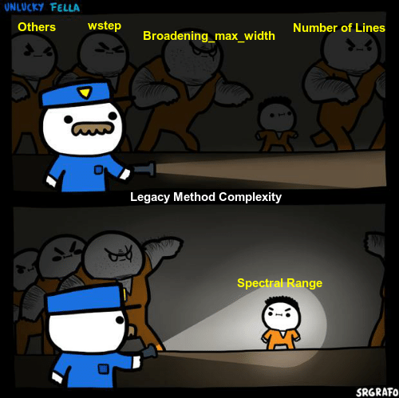

Hey! Missed me? I'm back with another blog, the first related to the Coding Period. Got some progress and interesting observation to share!

## Ready -> Set -> Code -> Analyze 

The first thing I did in the coding period, was analyse the problem and get a feasible approach to resolve it.<br>

**Problem:** Find the complexity of the Legacy and LDM method<br>
**Solution:** Run some benchmarks and find the bottleneck step.<br>

First I chose the **Legacy** method because if its simpler architecture. I ran some benchmarks varying the `spectral range` of `OH` and `CO2` molecule to get similar number of lines. I kept parameters like `pressure`, `temperature`, `broadening_max_width`, `wstep`, etc constant to see the dependence of Legacy method on **Spectral range**. <br>

In order to get similar number of lines, I created a function which will take the **Spectrum Factory** `dataframe` and select the target number of lines. But the issue with Pandas dataframe is that when modify the dataframe there are chances that the metadata will get lost and we will no longer be able to do Spectrum calculation. To avoid this we have to drop the right number of lines with `inplace=True`. So we will need to fix the number of lines and then we can proceed ahead with the benchmarking. Every parameter is the same except the Spectral Range.  Full code [here](https://gist.github.com/anandxkumar/cbe12f47170e1d71a82f4b246bd01dcc):<br>

Earlier we assumed that the complexity of Legacy method is: <br>
 **`Voigt Broadening = Broadening_max_width * spectral_range/math.pow(wstep,2) * N`** <br>

Thus I was expecting to have different calculation time for both benchmarks. But to my surprise the computational time was almost equivalent! I re-ran each benchmarks 100 times just to be sure and more precise about it. Following were the observations:<br>

- Number of lines - <b>{'OH': 28143, 'CO': 26778}</b>
- Total Calculation time(Avg) -  <b>{'OH': 4.4087, 'CO': 3.8404000000000003}</b>
- Total Voigt_Broadening TIME(Avg) - <b>{'OH': 3.1428814244270327, 'CO': 3.081623389720917}</b>
- spectral_range - <b>{'OH': 38010, 'CO': 8010}</b>
- Legacy_Scale - <b>{'OH': 4x10^14, 'CO': 8x10^13}</b>

There are some inference we can make from the above observation:<br>

**A)** The bottleneck step(Voigt Broadening) loosely depend on `Spectral Range`.<br>
**B)** The complexity of Voigt Broadening needs to be updated because there is a difference of order of **~10** in the Legacy Scaled value of OH and CO2.<br>

<p align="center">
<br>
<b>Credits - Me :p</b><br>
</p>

So in order to do some analysis, we first need data of different steps in the broadening phase and conditions of various Spectrum which brings me to the **Code** part in **Coding Period.**<br>

## Profiler Class

The aim of this class is to replace all the print statements by a common `start`, `stop`, `_print` method. Earlier each step computational time was done using `time()` library. Now the whole codebase is being refactored with the Profiler class that will do all the work based on the `verbose` level. In addition to this the biggest benefit is that each step will be stored in a dictionary with its computational time that will help me gather data to find which step is in actual bottleneck and further which part of the function is the most expensive time wise. A simple example is below:

**Before:**<br>
```
if __debug__:
    t0 = time()
..........
..........
if __debug__:
    t1 = time()
.........
.........
if __debug__:
    if self.verbose >= 3:
        printg("... Initialized vectors in {0:.1f}s".format(t1 - t0))
```

**After:**<br>
```
self.profiler.start(
    key="init_vectors", verbose=3, details="Initialized vectors"
)
.........
.........
self.profiler.stop("init_vectors")
```
So using a common key we can make it happen. This will be stored in the conditons of `Spectrum` object in the `'profiler'` key. All these Spectrums and their conditions can be exported using a [SpecDatabase](https://radis.readthedocs.io/en/latest/spectrum/spectrum.html#spectrum-database). This will create a csv file comprising of all the parameters of all Spectrums which will be useful in getting some insights.
-> [PR LINK](https://github.com/radis/radis/pull/286)


## Digging in whiting_jit

Based on several benchmarks, it is estimated that around **70-80%** time is spent on calculating the broadening. The broadening part has the following hierarchy:<br>
<b>
```
_calc_broadening()
-> _calc_lineshape()
   -> _voigt_broadening()
      -> _voigt_lineshape()
         -> whiting_jit()
```
</b>

On close inspection we observed that **80-90%** time is spent on `whiting_jit` process. Going further down in `whiting_jit`, **60-80%** time is spent on **lineshape calculation.** Below is the formula:<br>
```
lineshape = (
    (1 - wl_wv) * exp(-2.772 * w_wv_2)
    + wl_wv * 1 / (1 + 4 * w_wv_2)
    # ... 2nd order correction
    + 0.016 * (1 - wl_wv) * wl_wv * (exp(-0.4 * w_wv_225) - 10 / (10 + w_wv_225))
)
```

The whole process can be divided into 4 parts:<br>
```
    part_1 =   (1 - wl_wv) * exp(-2.772 * w_wv_2)

    part_2 =    wl_wv * 1 / (1 + 4 * w_wv_2)

    # ... 2nd order correction
    part_3 =  0.016 * (1 - wl_wv) * wl_wv * exp(-0.4 * w_wv_225) 

    part_4 =  - 10 / (10 + w_wv_225)
```

The complexity of each part comes out: <br>
<b>
```
    o1 = broadening__max_width * n_lines / wstep

    O(part_1) = n_lines * o1
    O(part_2) = n_lines * 4 * o1
    O(part_3) = (n_lines)**2 * o1
    O(part_4) = o1 
```
</b>
Running several benchmark showed us that **part_3** takes the most time out of all steps. So clearly we can see that the complexity of Legacy method is not dependent on
Spectral Range but rather `Number of Calculated Lines`,`broadening__max_width` and `wstep`. It may seem that the complexity of Legacy method is:<br>

<p align="center"><b> n_lines^2 * broadening__max_width * n_lines / wstep</b></p> <br>

But inorder to prove this we need more benchmarks and evidence to verify this and it may involve normalization of all steps in lineshape calculation!<br> 

So the goal for the next 2 weeks is clear:<br> 
i) Refactor the entire codebase with Profiler.<br>
ii) Find the complexity of Legacy Method with the help of more benchmark and analysis.<br>
iii) Do the same for LDM!<br>

Ok I guess time's up! See you after 2 weeks :)