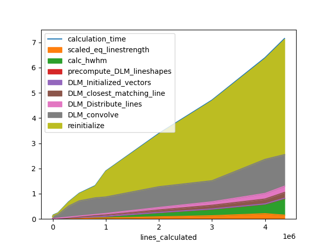
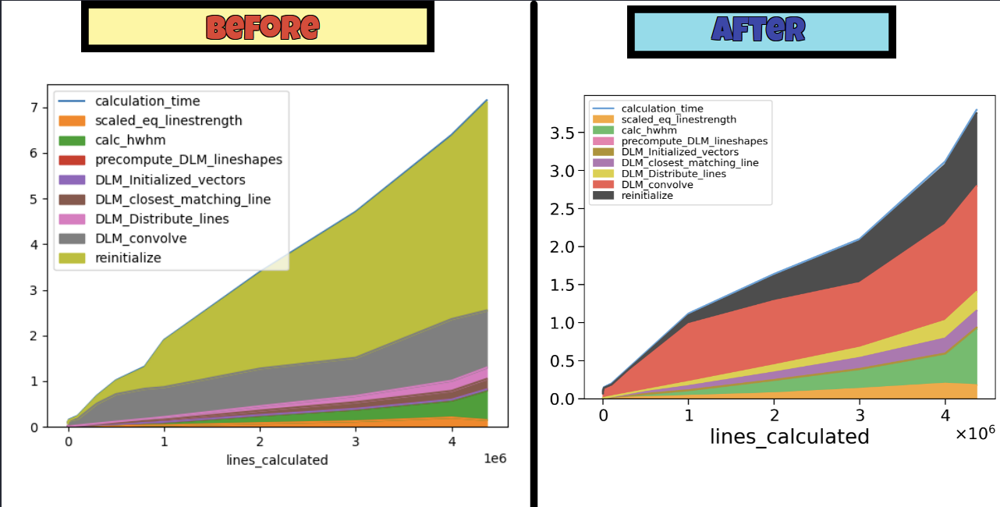

Phase 1 is over :) ! We are half way through the journey. Great learning experience so far. Let's find out what I accomplished during the previous 2 weeks (since I believe you have been following me from the beginning ;)

Getting straight to point, most of the time was spent on fixing bugs of the Profiler class and other Pull requests regarding documentation and gallery example. A new gallery example was added to demonstrate the working of `SpecDatabase` and `init_database` to help user to store all Spectrums in the form of a `.spec` file and all input parameters in a `csv` file under a folder. The same folder can be used to retrieve all Spectrums thus saving a lot of time and also no need to recompute all spectrums, so quite a handy feature. Radis has `plot_cond` function to plot a 2D heat map based on the parameters in csv file for all spectrums. Creates some good looking and informative plots :) <br>-> [Gallery Example](https://radis.readthedocs.io/en/latest/auto_examples/plot_SpecDatabase.html#sphx-glr-auto-examples-plot-specdatabase-py)<br>

Back to the analysis part; for LDM we expected:<br>

```
time(LDM_fft) ~ c2*N_lines + c3*(N_G*N_L + 1)*N_v*log(N_v) (where N_v =  Spectral Points)
time(LDM_voigt) ~ c2*N_lines + c3'*(N_G*N_L + 1)*N_truncation*log(N_truncation) (where N_truncation = broadening width / wstep)
```

For Legacy method I was able to prove that Calculation Time is independent of Spectral Range if we keep the N_lines and wstep constant but same is not for LDM voigt.<br>
A straight up comparison between Legacy and LDM voigt for NO  keeping N_lines and wstep constant and varying the Spectral range:
[Link](https://public.tableau.com/app/profile/anand.kumar4841/viz/LDMvsLegacyforSpectralRangeN_linesconstantandVoigtbroadening/Sheet1)<br>
Here also for None optimization we are getting constant time for different spectral range but a linear dependency for LDM Voigt which will fail the assumption of
```
t_LDM_voigt ~ c2*N_lines + c3'*(N_G*N_L + 1)*N_truncation  *log(N_truncation  )
but rather t_LDM_voigt ~ c2*N_lines + c3*(N_G*N_L + 1)*N_v*log(N_v)
```
## A New Discovery

On generating spectrum for millions of lines, one unique observation was seen. The bottleneck step was no longer taking the most time. Max time was spent upon an unknown process. Upon deep analysis it was found a part of code was using `sys.getsizeof()` to get the size of dataframe, and when the dataframe consisited of `object` type columns with millions of lines, most of the time was spent on this step only.

<br>

We replaced it with `memory_usage(deep=False)` with a different threshold which made computation almost **2x** faster.

<br>

So complexity of Legacy method can be derived as: <br>
 **`complexity = constant * Number of lines * Broadening Max Width / Wstep`** <br>


For `fft`:<br>
<b>
• Calculation Time ∝ Spectral Points<br>
• Calculation Time ∝ Number of Lines<br>
</b>
